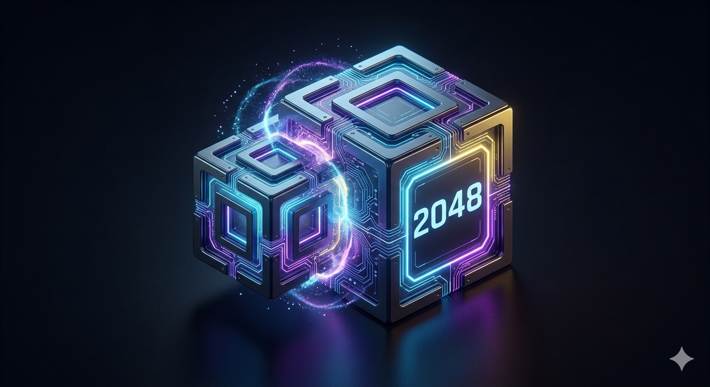

# 🎮 AI 協作開發：2048 霓虹版 
### 學號：D1114181708

這是使用 AI 工具輔助開發的 2048 數位融合遊戲網頁。本專案從視覺設計、核心邏輯到網頁部署，皆採用 AI 協作模式完成。

---

## 🚀 立即遊玩
**[👉 點擊此處進入遊戲網頁](https://abcd891215891215.github.io/D1114181708/)**

---

## 🎨 專案亮點

### 1. AI Logo 設計 (概念 B：數位融合感)
由 AI 生成的專屬標誌，結合了電路板紋路與 3D 方塊質感，完美契合科技感主題。

  

### 2. 進階 CSS 霓虹特效
針對數位方塊進行了視覺強化：
* **動態發光**：數字達 8 之後，方塊會產生強烈霓虹光暈。
* **漸層色彩**：隨著數字增加，顏色從冷色調轉為暖金與火紅。
* **勝利特效**：達成 2048 時，方塊具備獨特的「脈動 (Pulse)」動畫。

### 3. 多元操作支援
* **鍵盤操作**：支援電腦鍵盤方向鍵控制。
* **觸控按鈕**：為行動裝置使用者設計了虛擬控制鍵盤。

---

## 🛠️ 技術架構
* **前端語言**：HTML5, CSS3, JavaScript (ES6+)
* **部署平台**：GitHub Pages
* **AI 協作工具**：Gemini (代碼編寫、視覺微調)、Nano Banana 2 (Logo 生成)

---

## 📂 檔案結構說明
* `index.html`：遊戲主結構與 Logo 顯示介面。
* `style.css`：定義黑色主題、網格排版及強大的霓虹 CSS 樣式。
* `script.js`：處理方塊移動、合併邏輯與計分系統。
* `logo.png`：AI 生成的數位融合感標誌。

---
*© 2026 D1114181708. Created with AI Collaboration.*
